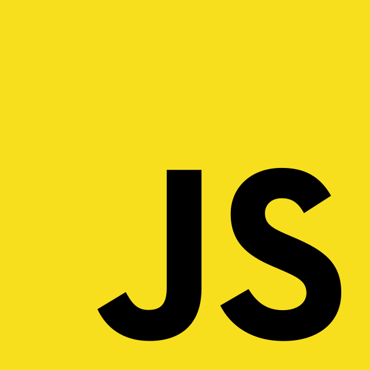
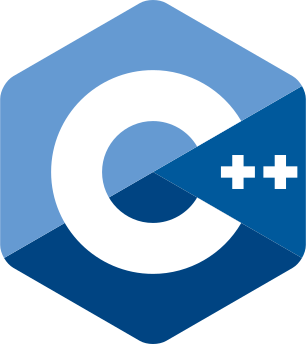

# Introduction

I am a video editor turned software developer, building in public using JavaScript/TypeScript. I am interested in building software for handling media workflows as well as general apps and games.

## Tech stack

## Social Media

